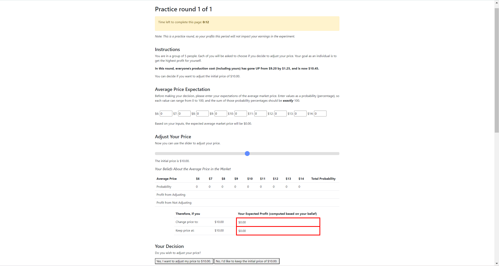

# OTree Experiment - Sticky Prices

[](https://github.com/RichardLitt/standard-readme)

> An oTree app for running an economic experiment on sticky prices and nominal rigidity.

## Table of Contents
- [Overview](#overview)
- [Details](#details)
- [Installation](#installation)
- [Usage](#usage)
- [About](#about)

## Overview



In each round, players act as firms who must set a price for their product. There is an initial default price, but players can choose to adjust this price up or down.

The profit for each player depends on:

1. Their own price
2. The average price of the market (set by other players)
3. Their production costs

Costs change each round, so players must decide whether to adjust their price in response or keep it "sticky". There is a cost for changing prices.

Players go through practice rounds with no payment, then a set of real rounds where profit translates to cash payouts.

At the end, there is a survey to collect demographics and measure loss aversion.

## Details

The main logic is in [`__init__.py`](https://github.com/cjy-2001/sticky-prices/blob/main/sticky_prices_WithCost/__init__.py). Key elements:

- Introduction page explains instructions
- 7 question quiz to check understanding
- Repeated game for set number of rounds
- Treatment variables set per round (cost, demand params)
- Players set probability distribution for expected average price
- Use slider to decide whether to adjust price
- Profit calculation based on price choices
- Results page shows profit after each round
- PracticeFeedback page between practice and real rounds
- Real rounds determine final payment
- Lottery page measures loss aversion
- Survey collects demographics
- PaymentInfo shows completion code and earnings

Player data can be analyzed using pagetimes.py to calculate time per page.

## Installation

Make sure oTree is installed before running the app:

```bash
pip install otree
```

## Usage

To run the app:

1. Direct to the right directory (there are two versions of the game, with or without Adjust Cost)
2. Reset the database: otree resetdb
3. Start the server: otree devserver
4. Go to http://localhost:8000

Make sure to reset the database between test sessions.

## About

This oTree app was built for [Dr. Munro](https://sites.google.com/site/munrodavidr/home) to run real classroom experiments for researching nominal rigidity in economics. The experiment workflow and theory is based on the paper [Sticky Prices](https://www.nber.org/system/files/working_papers/w2327/w2327.pdf).